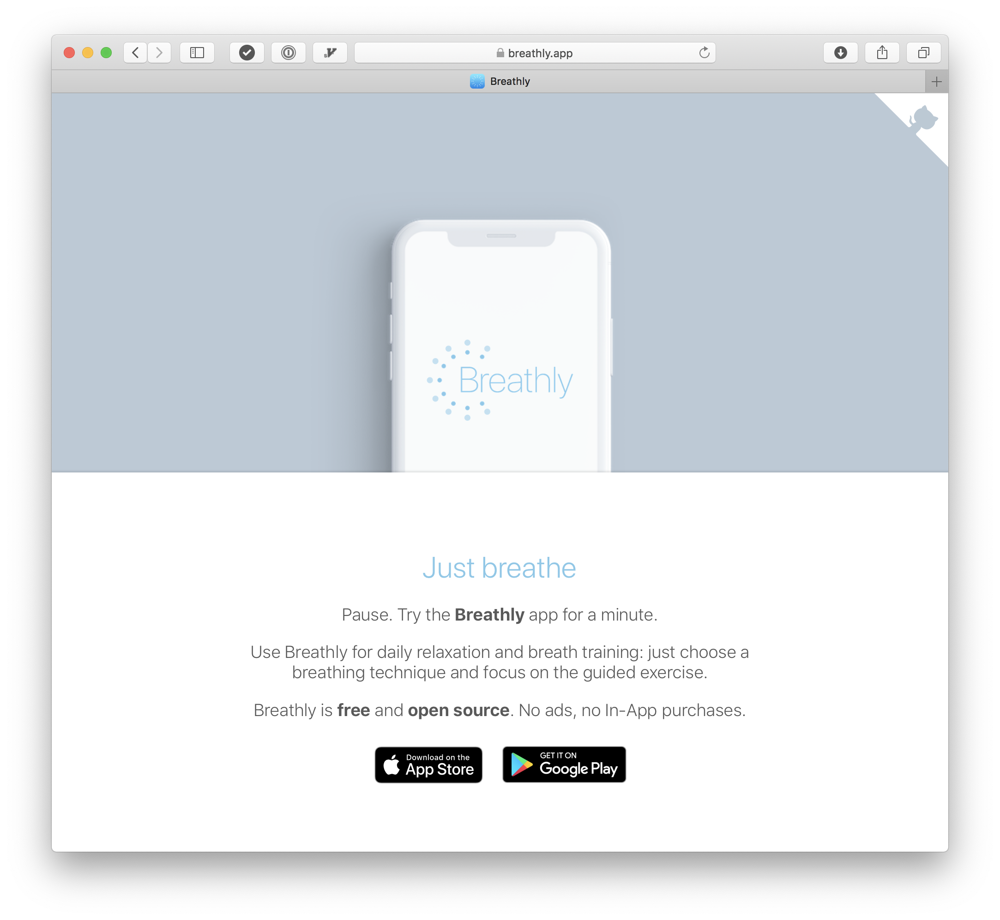

&nbsp;

# Breathly 

&nbsp;

Breathly is a React-Native mobile app that allows you to focus on your breathing.
You can use Breathly for daily relaxation and breath training: just choose a breathing technique and focus on the guided exercise.

&nbsp;

  

## Overview

In this repository you'll be able to find the source code of the Breathly app website.

The website can be build using `yarn run build`, which runs a simple Gulp script that takes care of:

- Minifying the CSS code and parsing the PostCSS features
- Minifying the website images
- Move all the files in the `build` directory

The website doesn't use JavaScript (no, I'm not using Google Analytics).

### Acknowledgements

I used [this mockup](https://gumroad.com/l/edFPQ) from [Lstore design goodies](https://gumroad.com/lstore) to create the top image.  

The Breahly landing page is deployed using [Netlify](https://app.netlify.com).  

## Contributing

Pull requests are welcome. File an issue for ideas, conversation or feedback.
